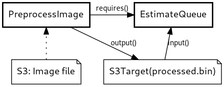

Gjenbruksstasjoner køtidestimering
==================================

Luigi tasks for predicting queue time estimates for recycling stations in Oslo.



## Setup

Requires python >= 3.7
`make init`
`python3 -m venv .venv`
`source .venv/bin/activate`

### Installing global python dependencies

You can either install globally. This might require you to run as root (use sudo).

Requires python >= 3.7
```bash
python3 -m pip install tox black pip-tools
```

Or, you can install for just your user. This is recommended as it does not
require root/sudo, but it does require `~/.local/bin` to be added to `PATH` in
your `.bashrc` or similar file for your shell. Eg:
`PATH=${HOME}/.local/bin:${PATH}`.

```bash
python3 -m pip install --user tox black pip-tools
```


### Installing local python dependencies in a virtualenv

```bash
python3 -m venv .venv
source .venv/bin/activate
pip install -r requirements.txt
```

```bash
make init
```


## Tests

Tests are run using [tox](https://pypi.org/project/tox/): `make test`

For tests and linting we use [pytest](https://pypi.org/project/pytest/),
[flake8](https://pypi.org/project/flake8/) and
[black](https://pypi.org/project/black/).

## Running locally

Running the code locally depends on the following environment variable:

```bash
export BUCKET_NAME=ok-origo-dataplatform-dev
```

Start the Luigi task runner, adjusting the `prefix` parameter as needed:

```bash
python -m luigi --module queue_time_predictions.tasks PreprocessImage --prefix=test/my-testing-bucket --local-scheduler
```

## Deploy

TODO.
